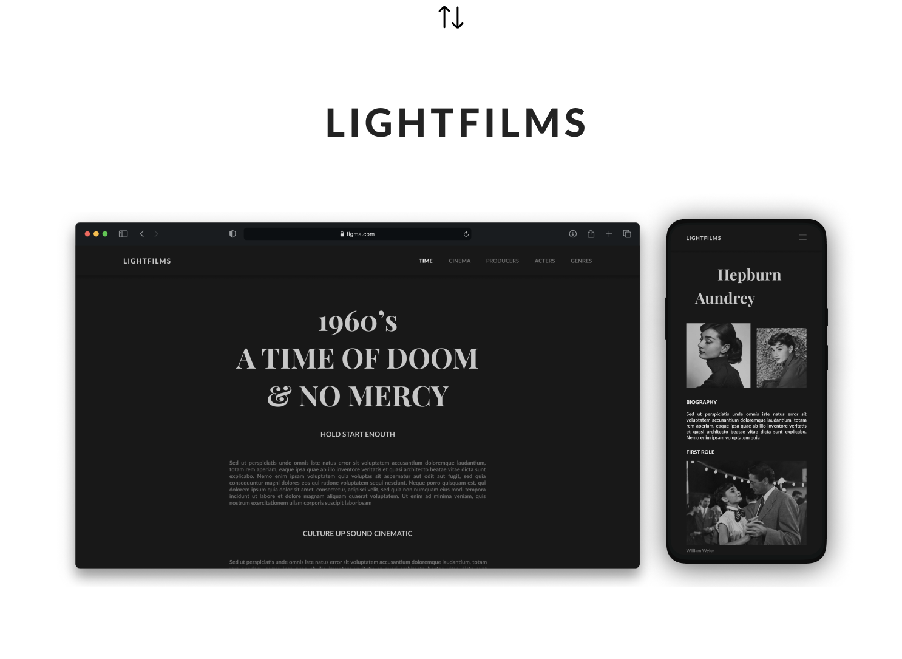

## GraphQL LIGHTFILMS API written in ExpressJS

[LIGHTFILMS]

Live preview [here] \
Deployed thanks to [Heroku] \
Database: [Firebase]

Used package manager: [NPM]

## Useful documentation

- https://habr.com/ru/post/424199/
- https://www.apollographql.com/docs/react/data/queries/
- https://www.apollographql.com/docs/react/data/fragments/

 

Made with love ❤️

I'm on Telegram: **@ssandry0** \
I'm on Behance: **https://www.behance.net/aftertaste** \
I'm on Dribbble: **https://dribbble.com/ssandry0**

[lightfilms]: https://github.com/ssandry/lightfilms
[here]: https://lightfilms-api.herokuapp.com/graphql
[firebase]: https://firebase.google.com/
[heroku]: https://dashboard.heroku.com/
[nodejs]: https://dashboard.heroku.com/
[npm]: https://www.npmjs.com/
