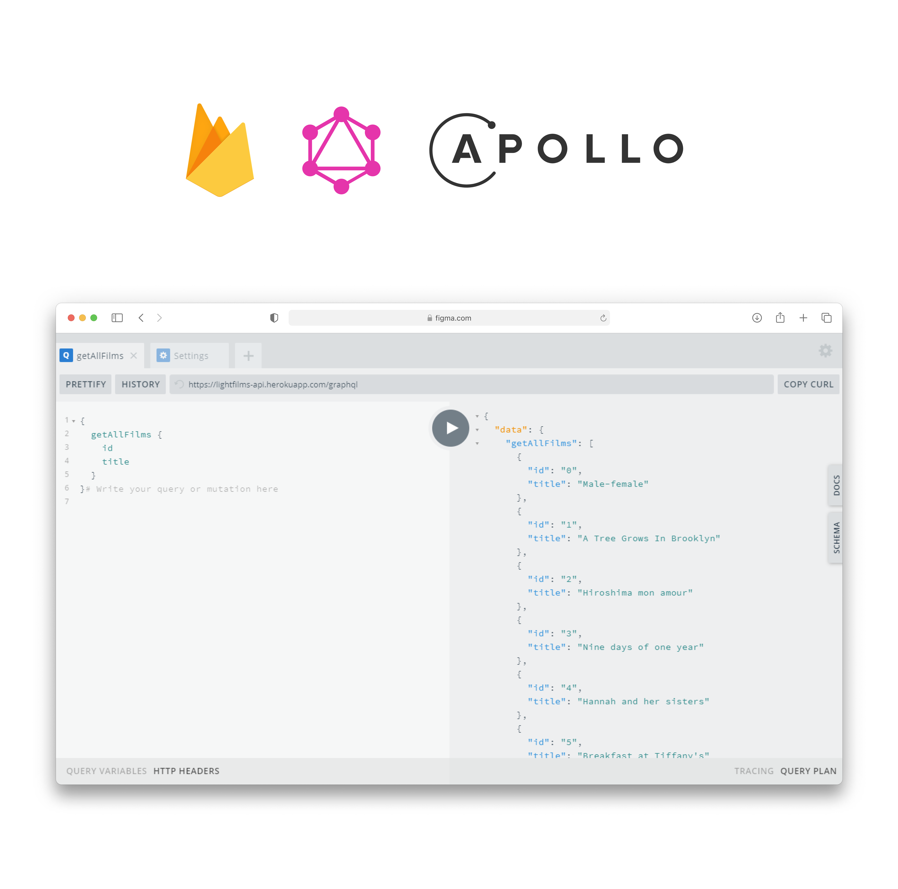

## API for the lightfilms repository

**[LIGHTFILMS]**

**Live preview [here]** \
**Deployed thanks to [Heroku]** \
**Database: [Firebase]**

**Used package manager: [NPM]**

## GraphQL type description

```graphql
type Film {
    id: ID!
    title: String!
    coverIMG: String!
    genres: [String]
    countries: [String]
    year: String!
    producer: Card!
    about: About!
}
```

## GraphQL query

```graphql
{
  getAllFilms {
    id
    title
    about
  }
}
```

## Example of a GraphQL response

```json
{
  "data": {
    "getAllFilms": [
      {
        "id": "0",
        "title": "Male-female",
        "about": "About Film"
      }
    ]
  }
}
```

## Useful documentation

- **https://habr.com/ru/post/424199/**
- **https://www.apollographql.com/docs/react/data/queries/**
- **https://www.apollographql.com/docs/react/data/fragments/**

[LIGHTFILMS]: <https://github.com/ssandry/lightfilms>
[here]: <https://lightfilms-api.herokuapp.com/graphql>
[Firebase]: <https://firebase.google.com/>
[Heroku]: <https://dashboard.heroku.com/>
[NodeJS]: <https://dashboard.heroku.com/>
[NPM]: <https://www.npmjs.com/>
