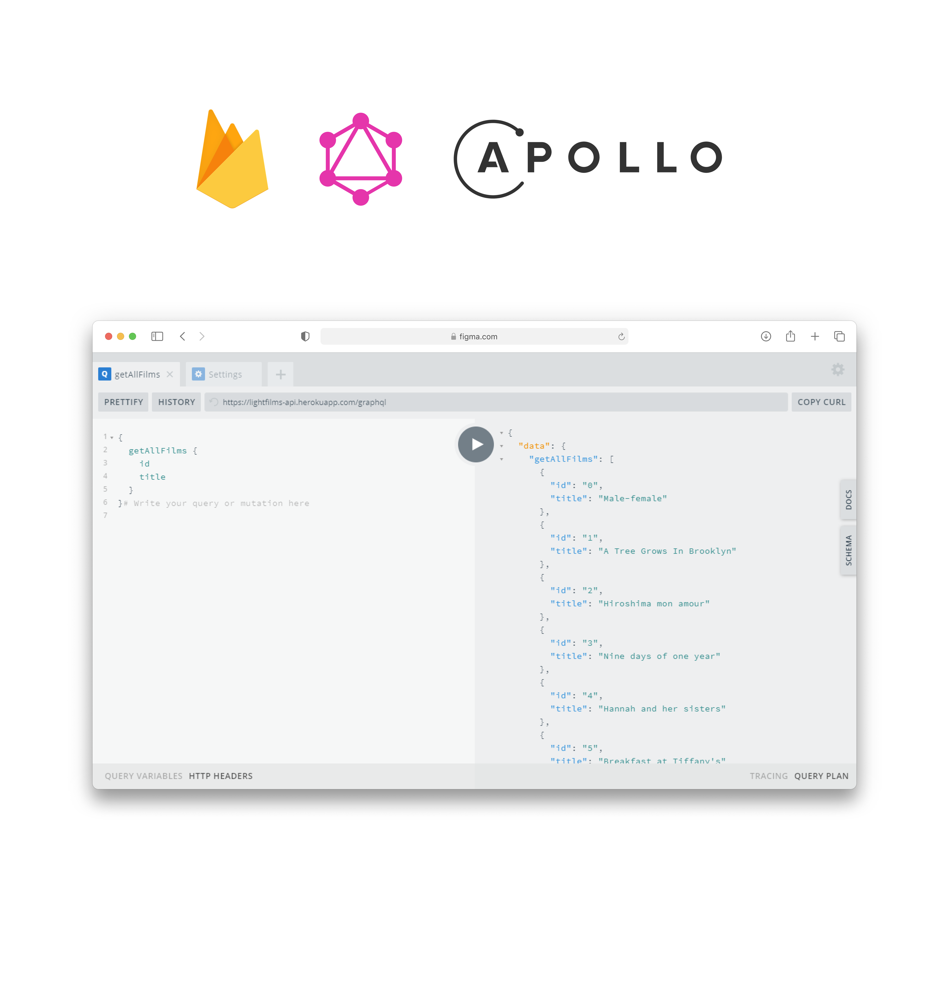

## 📡 API for the lightfilms repository.

**Live preview [here]** <br />
**Deployed thanks to [Heroku]**

## Setup

**Install && Setup project**

```sh
$git clone https://github.com/ssandry/lf-api.git
$cd lf-api
$npm install # or yarn 
```

## Start

**Start GraphQL server**

```sh
$npm run start # or yarn start
```

## GraphQL type description

**GraphQL type Person.**
**Check all types <a href = "https://github.com/ssandry/lf-api/blob/main/api/schema.gql"><i>here</i></a>**

```graphql
type Person {
    id: ID!
    name: String!
    title: String!
    countries: [String]!
    imgs: [String]!
    type: String!
    about: About2!
    briefAbout: String!
    filmography: [Card]!
    yearsPopular: [String]!
}
```

## GraphQL query

**More GraphQL query examples <a href = "https://github.com/ssandry/lf-api/blob/main/queries.md"><i>here</i></a>**

```graphql
{
  getAllPersons {
    id
    name
    countries
    type
  }
}
```

## Example of a GraphQL response

```json
{
  "data": {
    "getAllFilms": [
      {
        "id": "0",
        "title": "Male-female",
        "briefAbout": "About Film"
      }
    ]
  }
}
```

## Useful documentation

- **https://habr.com/ru/post/424199/**
- **https://www.apollographql.com/docs/react/data/queries/**
- **https://www.apollographql.com/docs/react/data/fragments/**

[here]: <https://lightfilms-api.herokuapp.com/graphql>
[Heroku]: <https://dashboard.heroku.com/>
